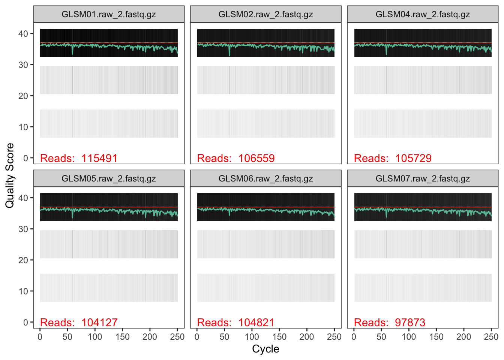
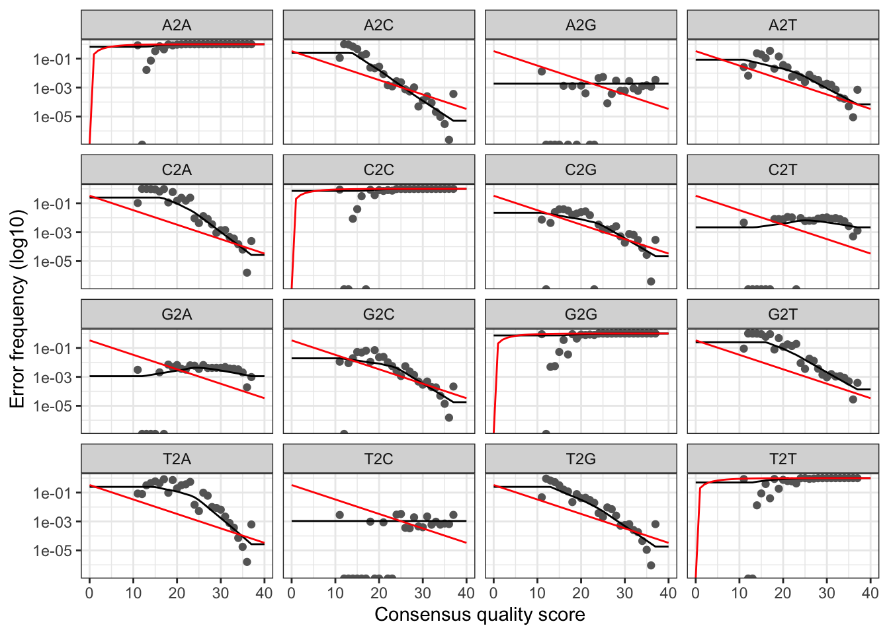

# Background

In this script we will process raw reads into ASVs via dada2, remove
chimeras, assign taxonomy, rarefy, and create a phyloseq object

This script is the first step in the 16S rRNA metabarcoding analyses of
bacterial, focused on cyanobacterial, community during a ozone
nanobubble (NBOT) treatment of Grand Lake St. Mary (GLSM), Ohio USA.

Amplification of eDNA with the 515F-926YR primer pair
“GTGYCAGCMGCCGCGGTAA” 515F “CCGYCAATTYMTTTRAGTTT” 926YR. Libraries were
sequenced using Illumina NovaSeq at UF ICBR.

# Load libraries and set paths

``` r
library(readxl)
library('dada2')
library(tidyverse)
library(phyloseq)
#library(microbiomeutilities) is used once so dont lead
#library(vegan) is used once so dont lead
setwd("/Users/flefler/Dropbox (UFL)/Laughinghouse_Lab/PROJECTS/GLSM/year2")
path <- "/Users/flefler/Dropbox (UFL)/Laughinghouse_Lab/PROJECTS/GLSM/year2/reads"
list.files(path)
```

    ##  [1] "filtered"              "GLSM01.raw_1.fastq.gz" "GLSM01.raw_2.fastq.gz"
    ##  [4] "GLSM02.raw_1.fastq.gz" "GLSM02.raw_2.fastq.gz" "GLSM04.raw_1.fastq.gz"
    ##  [7] "GLSM04.raw_2.fastq.gz" "GLSM05.raw_1.fastq.gz" "GLSM05.raw_2.fastq.gz"
    ## [10] "GLSM06.raw_1.fastq.gz" "GLSM06.raw_2.fastq.gz" "GLSM07.raw_1.fastq.gz"
    ## [13] "GLSM07.raw_2.fastq.gz" "GLSM08.raw_1.fastq.gz" "GLSM08.raw_2.fastq.gz"
    ## [16] "GLSM09.raw_1.fastq.gz" "GLSM09.raw_2.fastq.gz" "GLSM10.raw_1.fastq.gz"
    ## [19] "GLSM10.raw_2.fastq.gz" "GLSM13.raw_1.fastq.gz" "GLSM13.raw_2.fastq.gz"
    ## [22] "GLSM14.raw_1.fastq.gz" "GLSM14.raw_2.fastq.gz" "GLSM15.raw_1.fastq.gz"
    ## [25] "GLSM15.raw_2.fastq.gz" "GLSM16.raw_1.fastq.gz" "GLSM16.raw_2.fastq.gz"
    ## [28] "GLSM17.raw_1.fastq.gz" "GLSM17.raw_2.fastq.gz" "GLSM18.raw_1.fastq.gz"
    ## [31] "GLSM18.raw_2.fastq.gz" "GLSM20.raw_1.fastq.gz" "GLSM20.raw_2.fastq.gz"
    ## [34] "GLSM22.raw_1.fastq.gz" "GLSM22.raw_2.fastq.gz" "GLSM23.raw_1.fastq.gz"
    ## [37] "GLSM23.raw_2.fastq.gz" "GLSM24.raw_1.fastq.gz" "GLSM24.raw_2.fastq.gz"
    ## [40] "GLSM25.raw_1.fastq.gz" "GLSM25.raw_2.fastq.gz" "GLSM26.raw_1.fastq.gz"
    ## [43] "GLSM26.raw_2.fastq.gz" "GLSM27.raw_1.fastq.gz" "GLSM27.raw_2.fastq.gz"
    ## [46] "GLSM28.raw_1.fastq.gz" "GLSM28.raw_2.fastq.gz" "GLSM29.raw_1.fastq.gz"
    ## [49] "GLSM29.raw_2.fastq.gz" "GLSM30.raw_1.fastq.gz" "GLSM30.raw_2.fastq.gz"
    ## [52] "GLSM31.raw_1.fastq.gz" "GLSM31.raw_2.fastq.gz" "GLSM32.raw_1.fastq.gz"
    ## [55] "GLSM32.raw_2.fastq.gz" "GLSM33.raw_1.fastq.gz" "GLSM33.raw_2.fastq.gz"
    ## [58] "GLSM34.raw_1.fastq.gz" "GLSM34.raw_2.fastq.gz" "GLSM35.raw_1.fastq.gz"
    ## [61] "GLSM35.raw_2.fastq.gz" "GLSM36.raw_1.fastq.gz" "GLSM36.raw_2.fastq.gz"
    ## [64] "GLSM37.raw_1.fastq.gz" "GLSM37.raw_2.fastq.gz" "GLSM38.raw_1.fastq.gz"
    ## [67] "GLSM38.raw_2.fastq.gz" "GLSM39.raw_1.fastq.gz" "GLSM39.raw_2.fastq.gz"
    ## [70] "GLSM41.raw_1.fastq.gz" "GLSM41.raw_2.fastq.gz" "GLSM42.raw_1.fastq.gz"
    ## [73] "GLSM42.raw_2.fastq.gz" "GLSM43.raw_1.fastq.gz" "GLSM43.raw_2.fastq.gz"
    ## [76] "GLSM44.raw_1.fastq.gz" "GLSM44.raw_2.fastq.gz" "GLSM46.raw_1.fastq.gz"
    ## [79] "GLSM46.raw_2.fastq.gz" "GLSM47.raw_1.fastq.gz" "GLSM47.raw_2.fastq.gz"
    ## [82] "GLSM48.raw_1.fastq.gz" "GLSM48.raw_2.fastq.gz"

# Examine quality of the reads

Forward and reverse fastq filenames have format: 1.fastq.gz and
2.fastq.gz

``` r
fnFs <- sort(list.files(path, pattern="1.fastq.gz", full.names = TRUE))
fnRs <- sort(list.files(path, pattern="2.fastq.gz", full.names = TRUE))
```

Extract sample names, assuming filenames have format:
SAMPLENAME_XXX.fastq

``` r
sample.names <- sapply(strsplit(basename(fnFs), "_"), `[`, 1)
```

Inspect read quality profiles

``` r
plotQualityProfile(fnFs[1:6]) #Forward Reads
```

    ## Warning: Removed 134 rows containing missing values or values outside the scale range
    ## (`geom_tile()`).


``` r
plotQualityProfile(fnRs[1:6]) #Reverse Reads
```

    ## Warning: Removed 117 rows containing missing values or values outside the scale range
    ## (`geom_tile()`).



# Filter and Trim

Data look prett good so will trunc by 10 and trim by primer length

``` r
filtFs <- file.path(path, "filtered", paste0(sample.names, "_F_filt.fastq.gz"))
filtRs <- file.path(path, "filtered", paste0(sample.names, "_R_filt.fastq.gz"))
names(filtFs) <- sample.names
names(filtRs) <- sample.names
out <- filterAndTrim(fnFs, filtFs, fnRs, filtRs, truncLen=c(240,240),
                     trimLeft = c(19,20), #filter F,R primer length
                     maxN=0, maxEE=c(4,4), truncQ=2, rm.phix=TRUE,
                     compress=TRUE, verbose = TRUE, multithread=TRUE)
head(out)
```

    ##                       reads.in reads.out
    ## GLSM01.raw_1.fastq.gz   115491    112532
    ## GLSM02.raw_1.fastq.gz   106559    103741
    ## GLSM04.raw_1.fastq.gz   105729    102864
    ## GLSM05.raw_1.fastq.gz   104127    101356
    ## GLSM06.raw_1.fastq.gz   104821    102223
    ## GLSM07.raw_1.fastq.gz    97873     95424

# Determining Error Rates

Since sequenced with NovaSeq, will alter loess function arguments
(weights and span and degree, also enforce monotonicity) From Jonalim’s
comment in benjjneb/dada2#1307. I didnt write this lol

## Create function

``` r
loessErrfun_mod4 <- function(trans) {
  qq <- as.numeric(colnames(trans))
  est <- matrix(0, nrow=0, ncol=length(qq))
  for(nti in c("A","C","G","T")) {
    for(ntj in c("A","C","G","T")) {
      if(nti != ntj) {
        errs <- trans[paste0(nti,"2",ntj),]
        tot <- colSums(trans[paste0(nti,"2",c("A","C","G","T")),])
        rlogp <- log10((errs+1)/tot)  # 1 psuedocount for each err, but if tot=0 will give NA
        rlogp[is.infinite(rlogp)] <- NA
        df <- data.frame(q=qq, errs=errs, tot=tot, rlogp=rlogp)
        
        # original
        # ###! mod.lo <- loess(rlogp ~ q, df, weights=errs) ###!
        # mod.lo <- loess(rlogp ~ q, df, weights=tot) ###!
        # #        mod.lo <- loess(rlogp ~ q, df)
        
        # jonalim's solution
        # https://github.com/benjjneb/dada2/issues/938
        mod.lo <- loess(rlogp ~ q, df, weights = log10(tot),degree = 1, span = 0.95)
        
        pred <- predict(mod.lo, qq)
        maxrli <- max(which(!is.na(pred)))
        minrli <- min(which(!is.na(pred)))
        pred[seq_along(pred)>maxrli] <- pred[[maxrli]]
        pred[seq_along(pred)<minrli] <- pred[[minrli]]
        est <- rbind(est, 10^pred)
      } # if(nti != ntj)
    } # for(ntj in c("A","C","G","T"))
  } # for(nti in c("A","C","G","T"))
  
  # HACKY
  MAX_ERROR_RATE <- 0.25
  MIN_ERROR_RATE <- 1e-7
  est[est>MAX_ERROR_RATE] <- MAX_ERROR_RATE
  est[est<MIN_ERROR_RATE] <- MIN_ERROR_RATE
  
  # enforce monotonicity
  # https://github.com/benjjneb/dada2/issues/791
  estorig <- est
  est <- est %>%
    data.frame() %>%
    mutate_all(funs(case_when(. < X40 ~ X40,
                              . >= X40 ~ .))) %>% as.matrix()
  rownames(est) <- rownames(estorig)
  colnames(est) <- colnames(estorig)
  
  # Expand the err matrix with the self-transition probs
  err <- rbind(1-colSums(est[1:3,]), est[1:3,],
               est[4,], 1-colSums(est[4:6,]), est[5:6,],
               est[7:8,], 1-colSums(est[7:9,]), est[9,],
               est[10:12,], 1-colSums(est[10:12,]))
  rownames(err) <- paste0(rep(c("A","C","G","T"), each=4), "2", c("A","C","G","T"))
  colnames(err) <- colnames(trans)
  # Return
  return(err)
}
```

## Apply function to F and R reads

``` r
errF_4 <- learnErrors(
  filtFs,
  multithread = TRUE,
  nbases = 1e10,
  errorEstimationFunction = loessErrfun_mod4,
  verbose = TRUE
)
```

    ## 888804982 total bases in 4021742 reads from 41 samples will be used for learning the error rates.
    ## Initializing error rates to maximum possible estimate.
    ## selfConsist step 1 .........................................
    ##    selfConsist step 2
    ##    selfConsist step 3
    ##    selfConsist step 4
    ##    selfConsist step 5
    ##    selfConsist step 6
    ##    selfConsist step 7
    ## Convergence after  7  rounds.

``` r
errR_4 <- learnErrors(
  filtRs,
  multithread = TRUE,
  nbases = 1e10,
  errorEstimationFunction = loessErrfun_mod4,
  verbose = TRUE
)
```

    ## 884783240 total bases in 4021742 reads from 41 samples will be used for learning the error rates.
    ## Initializing error rates to maximum possible estimate.
    ## selfConsist step 1 .........................................
    ##    selfConsist step 2
    ##    selfConsist step 3
    ##    selfConsist step 4
    ##    selfConsist step 5
    ##    selfConsist step 6
    ##    selfConsist step 7
    ##    selfConsist step 8
    ##    selfConsist step 9
    ## Convergence after  9  rounds.

## Plot

At once point I knew what to for when I read up on this, but now I don’t
remember

``` r
plotErrors(errF_4, nominalQ = TRUE)
```

    ## Warning in scale_y_log10(): log-10 transformation introduced infinite values.
    ## log-10 transformation introduced infinite values.



``` r
plotErrors(errR_4, nominalQ = TRUE)
```

    ## Warning in scale_y_log10(): log-10 transformation introduced infinite values.
    ## log-10 transformation introduced infinite values.


# Applying sample inference algorithm

``` r
dadaFs <- dada(filtFs, err=errF_4, multithread=TRUE, pool=TRUE) #Forward Reads
```

    ## 41 samples were pooled: 4021742 reads in 400584 unique sequences.

``` r
dadaRs <- dada(filtRs, err=errR_4, multithread=TRUE, pool=TRUE) #Reverse Reads
```

    ## 41 samples were pooled: 4021742 reads in 484148 unique sequences.

``` r
dadaFs[[1]] #Identifies amount of sequence variants from forward reads.
```

    ## dada-class: object describing DADA2 denoising results
    ## 801 sequence variants were inferred from 16244 input unique sequences.
    ## Key parameters: OMEGA_A = 1e-40, OMEGA_C = 1e-40, BAND_SIZE = 16

``` r
dadaRs[[1]] #Identifies amount of sequence variants from reverse reads.
```

    ## dada-class: object describing DADA2 denoising results
    ## 1019 sequence variants were inferred from 18431 input unique sequences.
    ## Key parameters: OMEGA_A = 1e-40, OMEGA_C = 1e-40, BAND_SIZE = 16

## Merge paired reads

``` r
mergers <- mergePairs(dadaFs, filtFs, dadaRs, filtRs, verbose=TRUE)
```

    ## 109724 paired-reads (in 1837 unique pairings) successfully merged out of 111461 (in 2580 pairings) input.

    ## 100881 paired-reads (in 2016 unique pairings) successfully merged out of 102623 (in 2768 pairings) input.

    ## 99478 paired-reads (in 1894 unique pairings) successfully merged out of 101604 (in 2370 pairings) input.

    ## 98666 paired-reads (in 2029 unique pairings) successfully merged out of 100398 (in 2596 pairings) input.

    ## 98679 paired-reads (in 2887 unique pairings) successfully merged out of 101008 (in 4131 pairings) input.

    ## 92913 paired-reads (in 2332 unique pairings) successfully merged out of 94464 (in 3087 pairings) input.

    ## 98368 paired-reads (in 2324 unique pairings) successfully merged out of 100194 (in 3220 pairings) input.

    ## 48882 paired-reads (in 1572 unique pairings) successfully merged out of 49719 (in 2038 pairings) input.

    ## 98923 paired-reads (in 2086 unique pairings) successfully merged out of 101119 (in 3013 pairings) input.

    ## 100519 paired-reads (in 1546 unique pairings) successfully merged out of 101619 (in 1864 pairings) input.

    ## 98320 paired-reads (in 2071 unique pairings) successfully merged out of 100242 (in 2638 pairings) input.

    ## 65014 paired-reads (in 1446 unique pairings) successfully merged out of 66092 (in 1903 pairings) input.

    ## 98922 paired-reads (in 2124 unique pairings) successfully merged out of 100427 (in 2661 pairings) input.

    ## 99877 paired-reads (in 2643 unique pairings) successfully merged out of 101622 (in 3513 pairings) input.

    ## 97575 paired-reads (in 2289 unique pairings) successfully merged out of 98869 (in 2832 pairings) input.

    ## 97893 paired-reads (in 2360 unique pairings) successfully merged out of 99588 (in 3048 pairings) input.

    ## 102284 paired-reads (in 2967 unique pairings) successfully merged out of 103882 (in 3694 pairings) input.

    ## 63919 paired-reads (in 968 unique pairings) successfully merged out of 76976 (in 1365 pairings) input.

    ## 97534 paired-reads (in 2559 unique pairings) successfully merged out of 99215 (in 3186 pairings) input.

    ## 98742 paired-reads (in 3300 unique pairings) successfully merged out of 100917 (in 4411 pairings) input.

    ## 98802 paired-reads (in 2496 unique pairings) successfully merged out of 100429 (in 3061 pairings) input.

    ## 99442 paired-reads (in 1902 unique pairings) successfully merged out of 100994 (in 2289 pairings) input.

    ## 103765 paired-reads (in 2351 unique pairings) successfully merged out of 105215 (in 2846 pairings) input.

    ## 97309 paired-reads (in 2111 unique pairings) successfully merged out of 98977 (in 2526 pairings) input.

    ## 97847 paired-reads (in 2333 unique pairings) successfully merged out of 99210 (in 2819 pairings) input.

    ## 96634 paired-reads (in 2954 unique pairings) successfully merged out of 98793 (in 3706 pairings) input.

    ## 100063 paired-reads (in 2791 unique pairings) successfully merged out of 101382 (in 3417 pairings) input.

    ## 97099 paired-reads (in 2675 unique pairings) successfully merged out of 98705 (in 3293 pairings) input.

    ## 82962 paired-reads (in 2877 unique pairings) successfully merged out of 84343 (in 3501 pairings) input.

    ## 97321 paired-reads (in 2989 unique pairings) successfully merged out of 99208 (in 3656 pairings) input.

    ## 97034 paired-reads (in 3684 unique pairings) successfully merged out of 99424 (in 4863 pairings) input.

    ## 108632 paired-reads (in 3409 unique pairings) successfully merged out of 110314 (in 4215 pairings) input.

    ## 96725 paired-reads (in 2855 unique pairings) successfully merged out of 99891 (in 3475 pairings) input.

    ## 101129 paired-reads (in 3181 unique pairings) successfully merged out of 102954 (in 4010 pairings) input.

    ## 98036 paired-reads (in 3960 unique pairings) successfully merged out of 100342 (in 5280 pairings) input.

    ## 98225 paired-reads (in 2387 unique pairings) successfully merged out of 100024 (in 2863 pairings) input.

    ## 107440 paired-reads (in 3869 unique pairings) successfully merged out of 109588 (in 5094 pairings) input.

    ## 127866 paired-reads (in 5896 unique pairings) successfully merged out of 133489 (in 9483 pairings) input.

    ## 62689 paired-reads (in 2753 unique pairings) successfully merged out of 64843 (in 3980 pairings) input.

    ## 52865 paired-reads (in 1552 unique pairings) successfully merged out of 53670 (in 1870 pairings) input.

    ## 101455 paired-reads (in 2871 unique pairings) successfully merged out of 103738 (in 3605 pairings) input.

``` r
# Inspect the merger data.frame from the first sample
head(mergers[[1]])
```

    ##                                                                                                                                                                                                                                                                                                                                                                                                 sequence
    ## 1 CGCGGTAATACGGGGGATGCAAGCGTTATCCGGAATGATTGGGCGTAAAGAGTCCGTAGGTAGTCATCCAAGTCTGCTGTTAAAGAGCGAGGCTTAACCTCGTAAAGGCAGTGGAAACTGGAAGACTAGAGTGTAGTAGGGGCAGAGGGAATTCCTGGTGTAGCGGTGAAATGCGTAGAGATCAGGAAGAACACCGGTGGCGAAGGCGCTCTGCTGGGCTATAACTGACACTGAGGGACGAAAGCTAGGGGAGCGAATGGGATTAGATACCCCAGTAGTCCTAGCGGTAAACGATGGAAACTAGGTGTGGCCTGTATCGACCCGGGCCGTGCCGAAGCAAACGCGTTAAGTTTCCCGCCTGGGGAGTACGCACGCAAGTGTGAAACTTAA
    ## 2 CGCGGTAATACGGGGGATGCAAGCGTTATCCGGAATGATTGGGCGTAAAGAGTCCGTAGGTAGTCATCCAAGTCTGCTGTTAAAGAGCGAGGCTTAACCTCGTAAAGGCAGTGGAAACTGGAAGACTAGAGTGTAGTAGGGGCAGAGGGAATTCCTGGTGTAGCGGTGAAATGCGTAGAGATCAGGAAGAACACCGGTGGCGAAGGCGCTCTGCTGGGCTATAACTGACACTGAGGGACGAAAGCTAGGGGAGCGAATGGGATTAGATACCCCAGTAGTCCTAGCGGTAAACGATGGAAACTAGGTGTGGCCTGTATCGACCCGGGCCGTGCCGAAGCAAACGCGTTAAGTTTCCCGCCTGGGGAGTACGCACGCAAGTGTGAAACTCAA
    ## 3 CGCGGTAATACGGGGGATGCAAGCGTTATCCGGAATGATTGGGCGTAAAGAGTCCGTAGGTAGTCATCCAAGTCTGCTGTTAAAGAGCGAGGCTTAACTTCGTAAAGGCAGTGGAAACTGGAAGACTAGAGTGTAGTAGGGGCAGAGGGAATTCCTGGTGTAGCGGTGAAATGCGTAGAGATCAGGAAGAACACCGGTGGCGAAGGCGCTCTGCTGGGCTATAACTGACACTGAGGGACGAAAGCTAGGGGAGCGAATGGGATTAGATACCCCAGTAGTCCTAGCGGTAAACGATGGAAACTAGGTGTGGCCTGTATCGACCCGGGCCGTGCCGAAGCAAACGCGTTAAGTTTCCCGCCTGGGGAGTACGCACGCAAGTGTGAAACTTAA
    ## 4 CGCGGTAATACGGGGGATGCAAGCGTTATCCGGAATGATTGGGCGTAAAGAGTCCGTAGGTAGTCATCCAAGTCTGCTGTTAAAGAGCGAGGCTTAACTTCGTAAAGGCAGTGGAAACTGGAAGACTAGAGTGTAGTAGGGGCAGAGGGAATTCCTGGTGTAGCGGTGAAATGCGTAGAGATCAGGAAGAACACCGGTGGCGAAGGCGCTCTGCTGGGCTATAACTGACACTGAGGGACGAAAGCTAGGGGAGCGAATGGGATTAGATACCCCAGTAGTCCTAGCGGTAAACGATGGAAACTAGGTGTGGCCTGTATCGACCCGGGCCGTGCCGAAGCAAACGCGTTAAGTTTCCCGCCTGGGGAGTACGCACGCAAGTGTGAAACTCAA
    ## 5 CGCGGTAATACATAGGGTGCAAGCGTTGTCCGGAATTATTGGGCGTAAAGAGCTCGTAGGTGGTTCGTCACGTCGGATGTGAAACTCTGGGGCTTAACCCCAGACCTGCATTCGATACGGGCGAGCTTGAGTATGGTAGGGGAGTCTGGAATTCCTGGTGTAGCGGTGGAATGCGCAGATATCAGGAGGAACACCAATGGCGAAGGCAGGACTCTGGGCCATTACTGACACTGAGGAGCGAAAGCGTGGGGAGCGAACAGGATTAGATACCCTGGTAGTCCACGCCGTAAACGGTGGGCACTAGTTGTGGGGACCTTCCACGGTCTCTGCGACGCAGCTAACGCATTAAGTGCCCCGCCTGGGGAGTACGATCGCAAGATTAAAACTTAA
    ## 6 CGCGGTAATACATAGGGTGCAAGCGTTGTCCGGAATTATTGGGCGTAAAGAGCTCGTAGGTGGTTCGTCACGTCGGATGTGAAACTCTGGGGCTTAACCCCAGACCTGCATTCGATACGGGCGAGCTTGAGTATGGTAGGGGAGTCTGGAATTCCTGGTGTAGCGGTGGAATGCGCAGATATCAGGAGGAACACCAATGGCGAAGGCAGGACTCTGGGCCATTACTGACACTGAGGAGCGAAAGCGTGGGGAGCGAACAGGATTAGATACCCTGGTAGTCCACGCCGTAAACGGTGGGCACTAGTTGTGGGGACCTTCCACGGTCTCTGCGACGCAGCTAACGCATTAAGTGCCCCGCCTGGGGAGTACGATCGCAAGATTAAAACTCAA
    ##   abundance forward reverse nmatch nmismatch nindel prefer accept
    ## 1     26152       1       1     51         0      0      1   TRUE
    ## 2     21108       1       2     51         0      0      1   TRUE
    ## 3      8089       2       1     51         0      0      2   TRUE
    ## 4      6577       2       2     51         0      0      2   TRUE
    ## 5      3026       4       3     51         0      0      1   TRUE
    ## 6      2571       4       5     51         0      0      1   TRUE

## Construct sequence tables

``` r
seqtab <- makeSequenceTable(mergers) #Creates amplicon sequence table
dim(seqtab)
```

    ## [1]    41 16450

``` r
# Inspect distribution of sequence lengths
table(nchar(getSequences(seqtab)))
```

    ## 
    ##  222  287  291  293  304  312  319  323  325  343  347  352  354  358  361  365 
    ##    1    1    1    1    1    1    2    1    1    1    1    1    1    3    1    1 
    ##  378  379  380  381  382  383  384  385  386  387  388  389  390  391  392  393 
    ##    1    1    3    6   40   16  738   44 1470  251 3580  912 8017 1094  109   63 
    ##  394  395  396  397  398  399  402  405  410  412  413  415  424  429 
    ##   40   26    4    4    1    1    2    1    1    1    1    2    1    1

## Optional, but not really: remove non-target-length sequences from your sequence table

``` r
seqtab2 <- seqtab[,nchar(colnames(seqtab)) %in% 381:397] #get amplicons of the targeted length
```

## Super optional: Collapase those ASVs which differ by 1bp in length

But its slow and aint nobody got time for that

``` r
#dont run
#seqtab_collapse = collapseNoMismatch(seqtab2)
```

# Remove chimeras

``` r
seqtab.nochim <- removeBimeraDenovo(seqtab2, method="consensus", multithread=TRUE, verbose=TRUE)
```

    ## Identified 10465 bimeras out of 16414 input sequences.

``` r
dim(seqtab.nochim)
```

    ## [1]   41 5949

``` r
100*sum(seqtab.nochim)/sum(seqtab)
```

    ## [1] 95.1327

# Track reads through the pipeline

Determine the number of reads that made it through each step in the
pipeline

``` r
getN <- function(x) sum(getUniques(x))
track <- cbind(out, sapply(dadaFs, getN), sapply(dadaRs, getN), sapply(mergers, getN), rowSums(seqtab.nochim))
colnames(track) <- c("input", "filtered", "denoisedF", "denoisedR", "merged", "nonchim")
rownames(track) <- sample.names
head(track)
```

    ##             input filtered denoisedF denoisedR merged nonchim
    ## GLSM01.raw 115491   112532    111902    112054 109724  105802
    ## GLSM02.raw 106559   103741    103077    103225 100881   96796
    ## GLSM04.raw 105729   102864    102032    102196  99478   97874
    ## GLSM05.raw 104127   101356    100748    100953  98666   96101
    ## GLSM06.raw 104821   102223    101552    101631  98679   91605
    ## GLSM07.raw  97873    95424     94871     94990  92913   88430

``` r
track
```

    ##             input filtered denoisedF denoisedR merged nonchim
    ## GLSM01.raw 115491   112532    111902    112054 109724  105802
    ## GLSM02.raw 106559   103741    103077    103225 100881   96796
    ## GLSM04.raw 105729   102864    102032    102196  99478   97874
    ## GLSM05.raw 104127   101356    100748    100953  98666   96101
    ## GLSM06.raw 104821   102223    101552    101631  98679   91605
    ## GLSM07.raw  97873    95424     94871     94990  92913   88430
    ## GLSM08.raw 103364   101266    100631    100794  98368   93179
    ## GLSM09.raw  51537    50248     49931     50020  48882   47101
    ## GLSM10.raw 105145   102145    101547    101683  98923   94981
    ## GLSM13.raw 105233   102533    101953    102174 100519   98405
    ## GLSM14.raw 103937   101552    100718    100948  98320   96703
    ## GLSM15.raw  68507    66737     66333     66478  65014   63208
    ## GLSM16.raw 103858   101392    100812    100990  98922   96253
    ## GLSM17.raw 105434   102669    102060    102209  99877   95782
    ## GLSM18.raw 102055    99784     99241     99395  97575   94883
    ## GLSM20.raw 103249   100546     99965    100148  97893   95028
    ## GLSM22.raw 107291   104813    104292    104377 102284   97367
    ## GLSM23.raw  80658    78019     77575     77359  63919   59416
    ## GLSM24.raw 102937   100340     99677     99803  97534   94758
    ## GLSM25.raw 104851   102171    101468    101589  98742   90856
    ## GLSM26.raw 103882   101479    100832    101040  98802   95239
    ## GLSM27.raw 104256   101812    101285    101496  99442   96062
    ## GLSM28.raw 108984   106163    105569    105787 103765   99572
    ## GLSM29.raw 102590    99922     99344     99513  97309   94835
    ## GLSM30.raw 102142   100020     99514     99705  97847   93508
    ## GLSM31.raw 102355    99883     99261     99365  96634   92254
    ## GLSM32.raw 104862   102416    101813    101964 100063   95436
    ## GLSM33.raw 102278    99585     99082     99165  97099   92863
    ## GLSM34.raw  87341    85179     84750     84742  82962   78614
    ## GLSM35.raw 102976   100152     99617     99717  97321   92759
    ## GLSM36.raw 103300   100570     99926    100024  97034   89291
    ## GLSM37.raw 114598   111434    110827    110845 108632  103017
    ## GLSM38.raw 103442   100909    100299    100464  96725   92281
    ## GLSM39.raw 106761   104091    103457    103559 101129   95699
    ## GLSM41.raw 104469   101798    101040    101056  98036   88562
    ## GLSM42.raw 103403   100885    100353    100533  98225   94855
    ## GLSM43.raw 113573   110823    110268    110090 107440   98672
    ## GLSM44.raw 140227   136850    135233    134889 127866  109174
    ## GLSM46.raw  68061    66370     65589     65499  62689   55326
    ## GLSM47.raw  55554    54178     53860     53957  52865   51089
    ## GLSM48.raw 107634   104868    104191    104369 101455   97457

Note: Outside of filtering, there should be no step in which a majority
of reads are lost. If too many reads were lost return to filtering step.
\# Assign taxonomy Uing SILVA 138.1 and CyanoSeq 1.2.1 supplemented with
some strains isolated from GLSM

``` r
taxa <- assignTaxonomy(seqtab.nochim, minBoot = 80, "~/Dropbox (UFL)/Laughinghouse_Lab/CyanoSeq/Old_versions/v_1.2.1/CyanoSeq1.2.1_BLCC_SILVA138.1_dada2.fastq.gz", multithread = T, verbose = F)
```

# Create PhyloSeq object, remove non-target taxa, attach the ASVs

``` r
ps <- phyloseq(otu_table(seqtab.nochim, taxa_are_rows=FALSE),
               tax_table(taxa))
ps_clean = ps %>%
  subset_taxa((Class!="Chloroplast") | is.na(Class)) %>%
  subset_taxa((Kingdom != "Eukaryota") | is.na(Kingdom)) %>%
  subset_taxa((Family != "Mitochondria") | is.na(Family)) %>%
  subset_taxa((Phylum != "NA"))
ps_clean_2 <- microbiomeutilities::add_refseq(ps_clean,tag="ASV")
```

    ## Warning: replacing previous import 'ggplot2::alpha' by 'microbiome::alpha' when
    ## loading 'microbiomeutilities'

## rarefy

pull out the OTU table as a dataframe, it will take a minute

``` r
otutable = (ps_clean_2@otu_table) %>% as.data.frame()
vegan::rarecurve(otutable, step=50, cex=0.5)
```


## Do it

``` r
physeq <- rarefy_even_depth(ps_clean_2,
                            rngseed = 42069,
                            sample.size = min(sample_sums(ps_clean_2)),
                            replace = FALSE)
```

    ## `set.seed(42069)` was used to initialize repeatable random subsampling.

    ## Please record this for your records so others can reproduce.

    ## Try `set.seed(42069); .Random.seed` for the full vector

    ## ...

    ## 552OTUs were removed because they are no longer 
    ## present in any sample after random subsampling

    ## ...

## Attached Sample DataSheet

Its in two data sheets because I’m super organized /s

``` r
alldata <- readxl::read_excel("alldata.xlsx", col_types = c("text", "text", "date"))%>% select(-c(Site, Date))
DNA_conc <- readxl::read_excel("DNA_conc.xlsx")
METADATA = dplyr::left_join(DNA_conc, alldata, by = "Name") %>% column_to_rownames(var="SampleID")
physeq@sam_data <- phyloseq::sample_data(METADATA)
```

# Save PhyloSeq object and env

``` r
saveRDS(physeq, "physeq_alpha_GLSM_year2_2.rds")
save.image(file="physeq_alpha_GLSM_year2_2.RData")
```
