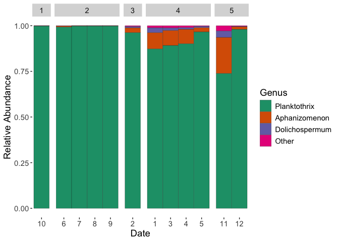
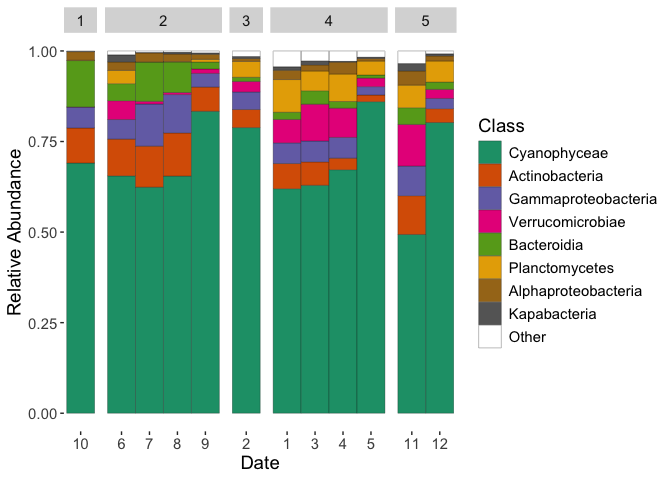
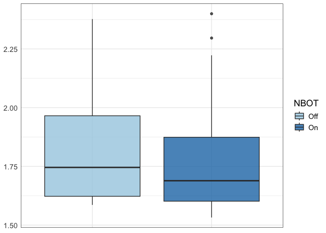
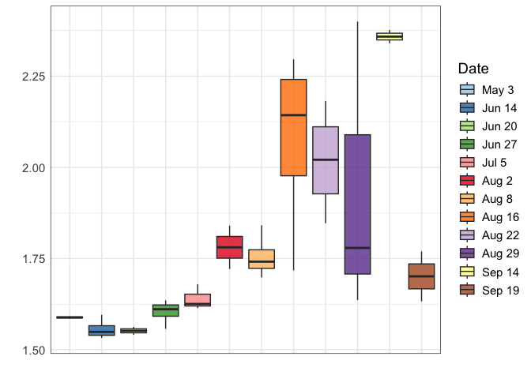
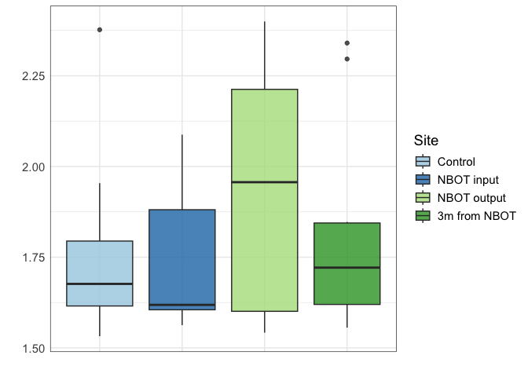
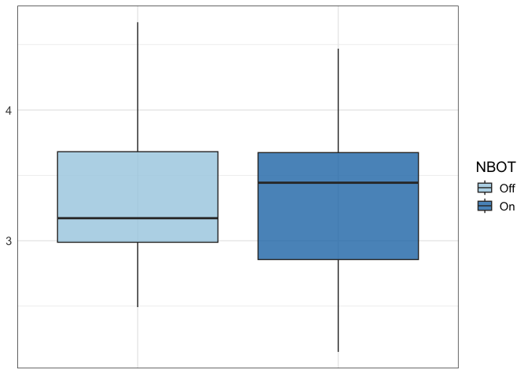
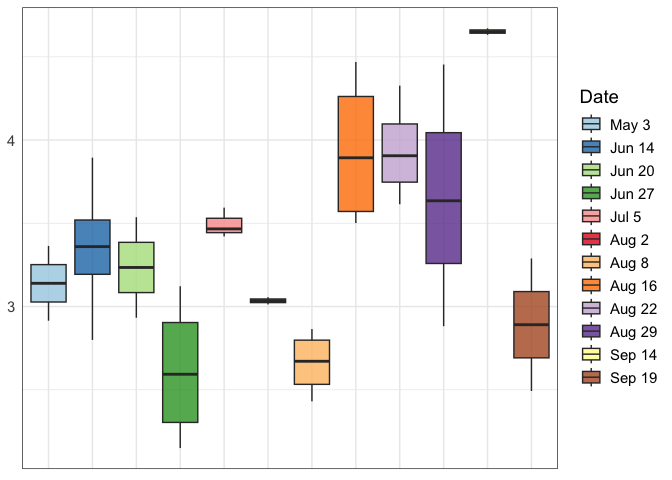
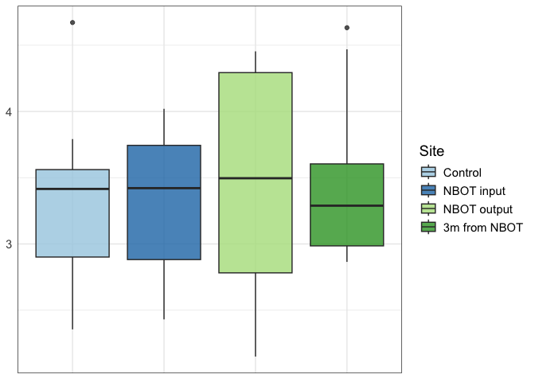
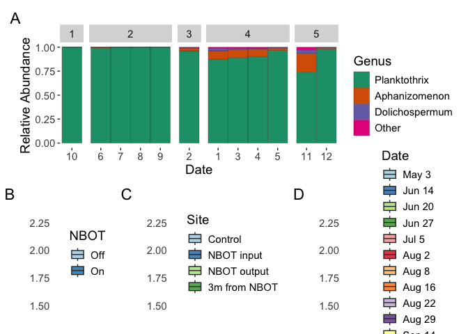
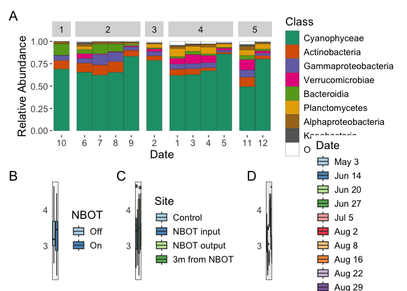

``` r
setwd("~/Dropbox (UFL)/Laughinghouse_Lab/PROJECTS/GLSM/year2")
library(tidyverse)
library(phyloseq)
library(microViz)
library(magrittr)
library(patchwork)
```

# Upload object and do some manipulation

``` r
physeq = readRDS("physeq_alpha_GLSM_year2.rds")
#There is probably and easier way to do this but whatever
physeq@sam_data$Outing = as.factor(physeq@sam_data$Outing)
physeq@sam_data$NBOT = as.factor(physeq@sam_data$NBOT)
physeq@sam_data$Site = as.factor(physeq@sam_data$Site)
physeq@sam_data$Sequence = as.factor(physeq@sam_data$Sequence)
physeq@sam_data$Date = as.factor(physeq@sam_data$Date)
#These sites and outings are being discarded
physeq2 = physeq %>% subset_samples(Name != "A23GL103") %>% subset_samples(Name != "A23GL100") %>% subset_samples(Outing != "2") %>% subset_samples(Outing != "8") %>% subset_samples(Outing != "15")
physeq2
```

    ## phyloseq-class experiment-level object
    ## otu_table()   OTU Table:         [ 5061 taxa and 36 samples ]
    ## sample_data() Sample Data:       [ 36 samples by 9 sample variables ]
    ## tax_table()   Taxonomy Table:    [ 5061 taxa by 6 taxonomic ranks ]
    ## refseq()      DNAStringSet:      [ 5061 reference sequences ]

Subset cyanobacteria

``` r
physeq_cyano = physeq2 %>% subset_taxa(Class == "Cyanophyceae")
physeq_cyano
```

    ## phyloseq-class experiment-level object
    ## otu_table()   OTU Table:         [ 339 taxa and 36 samples ]
    ## sample_data() Sample Data:       [ 36 samples by 9 sample variables ]
    ## tax_table()   Taxonomy Table:    [ 339 taxa by 6 taxonomic ranks ]
    ## refseq()      DNAStringSet:      [ 339 reference sequences ]

# Pluck out sample data sheet and do some manipulation

``` r
samdata2 = readxl::read_excel("DNA_conc.xlsx") %>%
           filter(Name != "A23GL103") %>% filter(Name != "A23GL100") %>%
           filter(Outing != "2") %>% filter(Outing != "8") %>% filter(Outing != "15")
head(samdata2)
```

    ## # A tibble: 6 × 10
    ##   SampleID   Name      Conc purity Site2 Site        Outing NBOT  Sequence Date 
    ##   <chr>      <chr>    <dbl>  <dbl> <chr> <chr>        <dbl> <chr>    <dbl> <chr>
    ## 1 GLSM01.raw A23GL002  38.4   1.97 E     Control          1 Off          1 May 3
    ## 2 GLSM02.raw A23GL007  67.2   1.95 EA    3m from NB…      1 Off          1 May 3
    ## 3 GLSM05.raw A23GL026  20.8   1.93 E     Control          3 On           2 Jun …
    ## 4 GLSM06.raw A23GL028  42.4   1.97 EN    NBOT input       3 On           2 Jun …
    ## 5 GLSM07.raw A23GL029  88     1.94 EA    3m from NB…      3 On           2 Jun …
    ## 6 GLSM08.raw A23GL033  20    NA    ET    NBOT output      3 On           2 Jun …

# BarPlots

## Cyanobacteria

The “Date” value ends up getting weird but the samples in the correct
order despite the funky order

``` r
Cya_Bar = physeq_cyano %>% tax_fix() %>%
  ps_select(Date, Sequence) %>%
  phyloseq::merge_samples(group = "Date") %>%
  ps_mutate(subject_timepoint = interaction(Date)) %>%
  comp_barplot(tax_level = "Genus", n_taxa = 3, nrow = 1,
               sample_order = "default", label = "subject_timepoint") +
  facet_grid(cols = vars(Sequence),
    scales = "free", space = "free") +
  labs(x = "Date",
       y = "Relative Abundance") +
  theme(text=element_text(size=14)) +
  scale_fill_brewer(palette = "Dark2")
Cya_Bar
```



## Bacteria

The “Date” value ends up getting weird but the samples in the correct
order despite the funky order

``` r
Bac_Bar = physeq2 %>% tax_fix() %>%
  ps_select(Date, Sequence) %>%
  phyloseq::merge_samples(group = "Date") %>%
  ps_mutate(subject_timepoint = interaction(Date)) %>%
  comp_barplot(tax_level = "Class", n_taxa = 8, nrow = 1,
               sample_order = "default", label = "subject_timepoint") +
  facet_grid(cols = vars(Sequence),
             scales = "free", space = "free") +
  labs(x = "Date",
       y = "Relative Abundance") +
  theme(text=element_text(size=14)) +
  scale_fill_brewer(palette = "Dark2")
Bac_Bar
```

    ## Warning in RColorBrewer::brewer.pal(n, pal): n too large, allowed maximum for palette Dark2 is 8
    ## Returning the palette you asked for with that many colors



# Alpha Diversity

## Cyanobacteria

``` r
tab_cya <-microbiome::alpha(physeq_cyano, index ="Shannon") %>% rownames_to_column(var = "SampleID")
alpha_data_cya = full_join(samdata2, tab_cya) %>% mutate(Sequence = as.factor(Sequence))%>% mutate(Outing = as.factor(Outing))
```

### NBOT

``` r
NBOT_cya_shan = alpha_data_cya %>% ggplot(aes(y=diversity_shannon, x = NBOT,fill = NBOT)) +
  geom_boxplot(width=0.8, alpha=0.8) +
  #geom_point(position = position_jitter(height = 0.2), alpha = 1, aes(shape = NBOT)) +
  theme_bw() +
  labs(x = NULL, y = NULL)  +
  theme(text=element_text(size=14), axis.ticks = element_blank(), axis.text.x = element_blank()) +
  scale_fill_brewer(palette = "Paired")
NBOT_cya_shan
```



### Date

``` r
alpha_data_cya$Date <- factor(alpha_data_cya$Date, levels = c("May 3", "Jun 14", "Jun 20", "Jun 27", "Jul 5", "Aug 2", "Aug 8", "Aug 16", "Aug 22", "Aug 29", "Sep 14", "Sep 19"))
Outing_cya_shan = alpha_data_cya %>% ggplot(aes(y=diversity_shannon, x = Date,fill = Date)) +
  geom_boxplot(width=0.8, alpha=0.8) +
  #geom_point(position = position_jitter(height = 0.2), alpha = 1, aes(shape = NBOT)) +
  theme_bw() +
  labs(x = "", y = "") +
  theme(text=element_text(size=14), axis.ticks = element_blank(), axis.text.x = element_blank()) +
  scale_fill_brewer(palette = "Paired")
Outing_cya_shan
```



### Site

``` r
alpha_data_cya$Site <- factor(alpha_data_cya$Site, levels = c("Control", "NBOT input", "NBOT output", "3m from NBOT"))
Site_cya_shan = alpha_data_cya %>% ggplot(aes(y=diversity_shannon, x = Site,fill = Site)) +
  geom_boxplot(width=0.8, alpha=0.8) +
  #geom_point(position = position_jitter(height = 0.2), alpha = 1, aes(shape = NBOT)) +
  theme_bw() +
  labs(x = "", y = "") +
  theme(text=element_text(size=14), axis.ticks = element_blank(), axis.text.x = element_blank()) +
  scale_fill_brewer(palette = "Paired")
Site_cya_shan
```



## Bacteria

``` r
tab_bac <-microbiome::alpha(physeq2, index = c("Shannon")) %>% rownames_to_column(var = "SampleID")
alpha_data_bac = full_join(samdata2, tab_bac) %>% mutate(Sequence = as.factor(Sequence))%>% mutate(Outing = as.factor(Outing))
```

### NBOT

``` r
NBOT_bac_shan = alpha_data_bac %>% ggplot(aes(y=diversity_shannon, x = NBOT,fill = NBOT)) +
  geom_boxplot(width=0.8, alpha=0.8) +
  theme_bw() +
  labs(x = NULL, y = NULL)  +
  theme(text=element_text(size=14), axis.ticks = element_blank(), axis.text.x = element_blank()) +
  scale_fill_brewer(palette = "Paired")
NBOT_bac_shan
```



### Date

``` r
alpha_data_bac$Date <- factor(alpha_data_bac$Date, levels = c("May 3", "Jun 14", "Jun 20", "Jun 27", "Jul 5", "Aug 2", "Aug 8", "Aug 16", "Aug 22", "Aug 29", "Sep 14", "Sep 19"))

Outing_bac_shan = alpha_data_bac %>% ggplot(aes(y=diversity_shannon, x = Date,fill = Date)) +
  geom_boxplot(width=0.8, alpha=0.8) +
  theme_bw() +
  labs(x = NULL, y = NULL)  +
  theme(text=element_text(size=14), axis.ticks = element_blank(), axis.text.x = element_blank()) +
  scale_fill_brewer(palette = "Paired")
Outing_bac_shan
```



### Outing

``` r
alpha_data_bac$Site <- factor(alpha_data_bac$Site, levels = c("Control", "NBOT input", "NBOT output", "3m from NBOT"))

Site_bac_shan = alpha_data_bac %>% ggplot(aes(y=diversity_shannon, x = Site,fill = Site)) +
  geom_boxplot(width=0.8, alpha=0.8) +
  theme_bw() +
  labs(x = NULL, y = NULL)  +
  theme(text=element_text(size=14), axis.ticks = element_blank(), axis.text.x = element_blank()) +
  scale_fill_brewer(palette = "Paired")
Site_bac_shan
```



# Alpha diversity stats

## Cyano

### Run the ANOVA

``` r
cya = aov(diversity_shannon ~ NBOT + Outing + Site + NBOT*Outing, alpha_data_bac)
summary(cya)
```

    ##             Df Sum Sq Mean Sq F value   Pr(>F)    
    ## NBOT         1  0.034  0.0341   0.181 0.674626    
    ## Outing      10 11.261  1.1261   5.982 0.000285 ***
    ## Site         3  0.146  0.0487   0.259 0.854335    
    ## Residuals   21  3.953  0.1882                     
    ## ---
    ## Signif. codes:  0 '***' 0.001 '**' 0.01 '*' 0.05 '.' 0.1 ' ' 1

So Outing (Date) has a sig effect

### EMMEANS of the ANOVA

``` r
cya_emmeans = emmeans::emmeans(cya, pairwise ~ Outing)
```

    ## NOTE: A nesting structure was detected in the fitted model:
    ##     Outing %in% NBOT

``` r
cya_emmeans$contrasts %>% as.data.frame() %>% filter(p.value <= 0.05)
```

    ##  contrast                     estimate        SE df t.ratio p.value
    ##  Outing9 Off - Outing14 Off  -1.617054 0.4338769 21  -3.727  0.0432
    ##  Outing14 Off - Outing16 Off  1.760741 0.4338769 21   4.058  0.0214
    ##  Outing14 Off - Outing5 On    2.068203 0.3848451 21   5.374  0.0012
    ##  Outing14 Off - Outing10 On   2.023362 0.3848451 21   5.258  0.0015
    ##  Outing5 On - Outing11 On    -1.324663 0.3067973 21  -4.318  0.0122
    ##  Outing5 On - Outing12 On    -1.323503 0.3067973 21  -4.314  0.0123
    ##  Outing10 On - Outing11 On   -1.279822 0.3067973 21  -4.172  0.0168
    ##  Outing10 On - Outing12 On   -1.278661 0.3067973 21  -4.168  0.0169
    ## 
    ## Results are averaged over the levels of: Site 
    ## P value adjustment: tukey method for comparing a family of 12 estimates

## Bacteria

### Run the ANOVA

``` r
bac = aov(diversity_shannon ~ NBOT + Outing + Site + NBOT*Outing, alpha_data_bac)
summary(bac)
```

    ##             Df Sum Sq Mean Sq F value   Pr(>F)    
    ## NBOT         1  0.034  0.0341   0.181 0.674626    
    ## Outing      10 11.261  1.1261   5.982 0.000285 ***
    ## Site         3  0.146  0.0487   0.259 0.854335    
    ## Residuals   21  3.953  0.1882                     
    ## ---
    ## Signif. codes:  0 '***' 0.001 '**' 0.01 '*' 0.05 '.' 0.1 ' ' 1

So Outing (Date) has a sig effect… again

### EMMEANS of the ANOVA

``` r
bac_emmeans = emmeans::emmeans(bac, pairwise ~ Outing)
```

    ## NOTE: A nesting structure was detected in the fitted model:
    ##     Outing %in% NBOT

``` r
bac_emmeans$contrasts %>% as.data.frame() %>% filter(p.value <= 0.05)
```

    ##  contrast                     estimate        SE df t.ratio p.value
    ##  Outing9 Off - Outing14 Off  -1.617054 0.4338769 21  -3.727  0.0432
    ##  Outing14 Off - Outing16 Off  1.760741 0.4338769 21   4.058  0.0214
    ##  Outing14 Off - Outing5 On    2.068203 0.3848451 21   5.374  0.0012
    ##  Outing14 Off - Outing10 On   2.023362 0.3848451 21   5.258  0.0015
    ##  Outing5 On - Outing11 On    -1.324663 0.3067973 21  -4.318  0.0122
    ##  Outing5 On - Outing12 On    -1.323503 0.3067973 21  -4.314  0.0123
    ##  Outing10 On - Outing11 On   -1.279822 0.3067973 21  -4.172  0.0168
    ##  Outing10 On - Outing12 On   -1.278661 0.3067973 21  -4.168  0.0169
    ## 
    ## Results are averaged over the levels of: Site 
    ## P value adjustment: tukey method for comparing a family of 12 estimates

# Compare community differences

##Cyano

``` r
physeq_cyano_dist = vegan::vegdist(physeq_cyano@otu_table, method="robust.aitchison")
vegan::adonis2(physeq_cyano_dist ~ NBOT +  Outing + Site + NBOT*Outing, permutations = 9999, data = samdata2)
```

    ## Permutation test for adonis under reduced model
    ## Terms added sequentially (first to last)
    ## Permutation: free
    ## Number of permutations: 9999
    ## 
    ## vegan::adonis2(formula = physeq_cyano_dist ~ NBOT + Outing + Site + NBOT * Outing, data = samdata2, permutations = 9999)
    ##             Df SumOfSqs      R2      F Pr(>F)    
    ## NBOT         1    137.3 0.02523 1.0646 0.3021    
    ## Outing       1    983.0 0.18060 7.6197 0.0001 ***
    ## Site         3    357.8 0.06573 0.9244 0.5611    
    ## NBOT:Outing  1    223.8 0.04111 1.7345 0.0455 *  
    ## Residual    29   3741.3 0.68733                  
    ## Total       35   5443.2 1.00000                  
    ## ---
    ## Signif. codes:  0 '***' 0.001 '**' 0.01 '*' 0.05 '.' 0.1 ' ' 1

Once again, outing (Date) has a significatn effect. NBOT:Outing really
wants to have a significant efect but just cant make it. Plus, the
significance of outing is so strong, plus the obvious temporal shifts in
bar plots and difference in alpha diversity tell me its outing doing all
the heavy lifting here.

##Bacteria

``` r
physeq2_dist = vegan::vegdist(physeq2@otu_table, method="robust.aitchison")
vegan::adonis2(physeq2_dist ~ NBOT + Outing + Site + NBOT*Outing, permutations = 9999, data = samdata2)
```

    ## Permutation test for adonis under reduced model
    ## Terms added sequentially (first to last)
    ## Permutation: free
    ## Number of permutations: 9999
    ## 
    ## vegan::adonis2(formula = physeq2_dist ~ NBOT + Outing + Site + NBOT * Outing, data = samdata2, permutations = 9999)
    ##             Df SumOfSqs      R2       F Pr(>F)    
    ## NBOT         1     1384 0.03106  1.4170 0.1041    
    ## Outing       1     9949 0.22320 10.1829 0.0001 ***
    ## Site         3     2478 0.05560  0.8455 0.7417    
    ## NBOT:Outing  1     2428 0.05447  2.4849 0.0088 ** 
    ## Residual    29    28333 0.63567                   
    ## Total       35    44572 1.00000                   
    ## ---
    ## Signif. codes:  0 '***' 0.001 '**' 0.01 '*' 0.05 '.' 0.1 ' ' 1

NBOT:Outing is more significant here, but i mean… this is the bacteria
in a very thic bloom so not as important. Maybe one day we can dig into
this more

# Making the Figures

Saved manually as PDF and then altered in adobe illustrator

``` r
F2= (Cya_Bar ) /
  (NBOT_cya_shan | Site_cya_shan | Outing_cya_shan)  + plot_annotation(tag_levels = "A")
F2
```



``` r
S1 = (Bac_Bar) /
  (NBOT_bac_shan | Site_bac_shan | Outing_bac_shan)  + plot_annotation(tag_levels = "A")
S1
```

    ## Warning in RColorBrewer::brewer.pal(n, pal): n too large, allowed maximum for palette Dark2 is 8
    ## Returning the palette you asked for with that many colors


